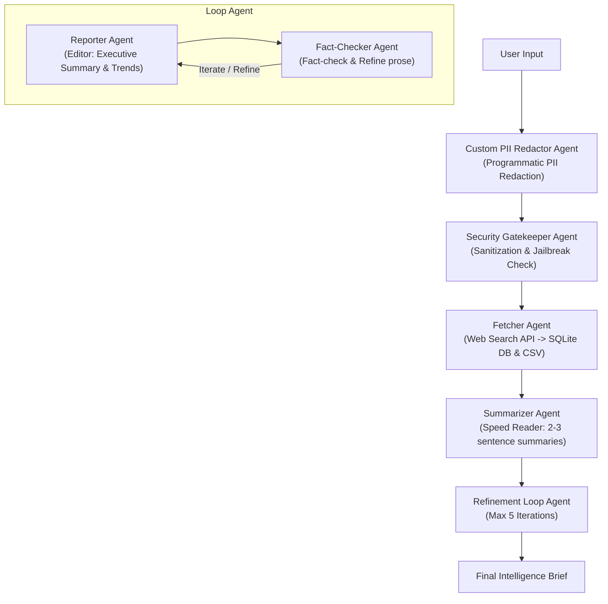

# Product Requirements Document (PRD): Agentic-News-Summarizer

## 1. Project Overview
**Agentic-News-Summarizer** is an enterprise-grade, multi-agent intelligence briefing system built with the **Google Agent Development Kit (ADK)**. It automates the end-to-end lifecycle of news ingestion, personal identifiable information (PII) redaction, security screening, web searching, speed summarization, editorial reporting, and rigorous iterative fact-checking. Designed for professionals and research teams, the system transforms raw query inputs into structured, verified, and secure executive news briefs.

---

## 2. Problem Statement
Staying informed across rapidly evolving domains creates significant operational challenges:
- **Information Overload**: Professionals spend excessive hours manually scouring, filtering, and reading fragmented news articles and web sources.
- **Privacy & PII Leakage Risks**: Unfiltered user prompts and queries frequently risk exposing sensitive personal data (emails, phone numbers, financial records) to external LLM and search APIs.
- **Vulnerability to Malicious Inputs**: Unchecked agent inputs are susceptible to prompt injection, system overrides, and jailbreak payloads.
- **Inconsistent Quality & Lack of Verification**: Single-pass automated summaries often contain hallucinations, lack editorial polish, or fail to cross-verify claims against source material.

---

## 3. Success Metrics
The success of Agentic-News-Summarizer is measured against the following quantitative and qualitative benchmarks:
- **PII Redaction Accuracy**: **100%** interception and replacement of sensitive PII tokens (emails, phone numbers, SSNs, credit card numbers) before downstream processing.
- **Security Defensiveness**: **0%** successful prompt injection or jailbreak bypasses handled by the Security Gatekeeper Agent.
- **Summarization Precision**: Concise article summaries strictly bound to **2–3 sentences** capturing core insights without hallucination.
- **Editorial & Fact-Check Iteration**: Successful multi-pass refinement via a `LoopAgent` pipeline (capped at 5 iterations) ensuring factual accuracy and professional prose quality.
- **Data Persistence Reliability**: **100%** successful dual-storage persistence of fetched articles into local **SQLite (`articles.db`)** and **CSV (`articles.csv`)** formats.

---

## 4. Agentic Architecture
The system employs a modular, decoupled multi-agent pipeline orchestrated via ADK `SequentialAgent` and `LoopAgent` patterns:

1. **Custom PII Redactor Agent** (`app/agents/redactor.py`):
   - Programmatically intercepts user inputs to sanitize and mask sensitive personal data.
2. **Security Gatekeeper Agent** (`app/agents/gatekeeper.py`):
   - Acts as a security barrier detecting and blocking prompt injections, overrides, and jailbreak attempts.
3. **Fetcher Agent** (`app/agents/fetcher.py`):
   - Executes web search API queries to gather fresh articles, enriching them with metadata (timestamps, word counts, unique IDs).
4. **Summarizer Agent** (`app/agents/summarizer.py`):
   - Functions as the "speed reader", generating precise 2-3 sentence summaries per retrieved article.
5. **Reporter & Fact-Checker Loop** (`app/agents/pipeline.py`, `app/agents/reporter.py`, `app/agents/fact_checker.py`):
   - **Reporter Agent**: Synthesizes article summaries into a cohesive executive report with trends and insights.
   - **Fact-Checker Agent**: Collaborates in a `LoopAgent` structure to verify claims, correct discrepancies, and polish the final briefing.

---

## 5. Dataflow
The execution dataflow follows a structured, secure progression:
1. **Request Ingestion**: The user submits a news topic or research query.
2. **PII Pre-Screening**: The Redactor Agent scans the raw text and replaces sensitive entities with secure placeholders (`[REDACTED_EMAIL]`, etc.).
3. **Security Validation**: The Gatekeeper Agent analyzes the redacted prompt to ensure safety against prompt injection and malicious payloads.
4. **Information Retrieval & Persistence**: The Fetcher Agent calls search tools, retrieves live articles, attaches timestamps, and writes records concurrently to `articles.db` and `articles.csv`.
5. **Speed Summarization**: The Summarizer Agent parses fetched text into concise 2-3 sentence summaries.
6. **Iterative Editorial & Fact-Checking**: The Reporter and Fact-Checker agents evaluate the draft in a controlled loop (up to 5 iterations) to ensure absolute factual grounding and clarity.
7. **Delivery**: The finalized, high-integrity executive briefing is delivered to the user with full traceability.

---

## 6. Security & Privacy Undertaken
Security and data protection are foundational to the architecture:
- **Proactive PII Redaction**: Programmatic filters strip out sensitive personal identifiers at the point of entry before any external LLM processing occurs.
- **Prompt Injection Defense**: Dedicated security gatekeeping inspects and sanitizes all payloads.
- **Secure Configuration & State Isolation**: Environment variables are strictly managed via `.env` guidelines, and conversation states are managed securely using ADK context compaction (`EventsCompactionConfig`).
- **Auditability & Traceability**: All ingested source articles are durably persisted in local SQLite and CSV stores for compliance and auditing.
