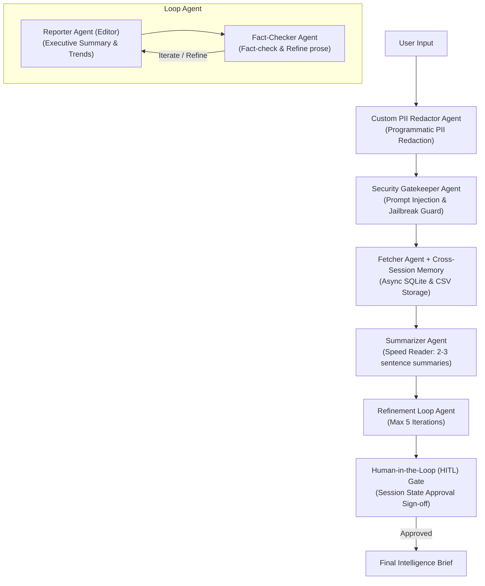

# Agentic-News-Summarizer

A production-grade, multi-agent summarizer assistant built with the Google Agent Development Kit (ADK) for summarizing and briefing of the news data. It orchestrates a multi-agent pipeline to ingest, redact PII, sanitize, search, summarize, edit, iteratively verify, human-approve daily news briefs, and deploy via Infrastructure as Code.

---

## Agents Overview

The system delegates responsibilities across specialized, segregated agents:

1. **Custom PII Redactor Agent** (`app/agents/redactor.py`):
   - Intercepts user prompts before any downstream processing.
   - Programmatically redacts personal identifiable information (PII) such as email addresses, phone numbers, SSNs, and credit card numbers.
2. **Security Gatekeeper Agent** (`app/agents/gatekeeper.py`):
   - Acts as the second line of defense on the redacted input.
   - Inspects user input for prompt injection, system overrides, and jailbreak attempts before allowing processing.
3. **Fetcher Agent** (`app/agents/fetcher.py`):
   - Makes web search API calls to retrieve fresh news and research articles.
   - Automatically enriches and organizes articles with metadata (word count, UTC timestamps, and unique IDs).
   - Persists all retrieved data into both **SQLite DB** (`articles.db`) and **CSV format** (`articles.csv`) asynchronously, and queries past articles for **cross-session memory**.
4. **Summarizer Agent** (`app/agents/summarizer.py`):
   - Acting as the "speed reader", it analyzes articles with Gemini API context understanding.
   - Generates concise summaries restricted strictly to **2-3 sentences** per article.
5. **Reporter Agent** (`app/agents/reporter.py`):
   - Acting as the editor, it synthesizes all article summaries into one cohesive report.
   - **Human-in-the-Loop (HITL) Gate**: Features an explicit approval code hook (`hitl_approval_callback`) pausing execution until human sign-off (`human_approved: true`) is granted in session state.
6. **Fact-Checker & Refiner Agent** (`app/agents/fact_checker.py`):
   - Works collaboratively with the Reporter Agent inside a `LoopAgent` to fact-check claims, correct inaccuracies, and refine prose.

---

## System Architecture



---

## Security, Privacy & HITL Controls

- **Programmatic PII Redaction (`app/agents/redactor.py`)**: Before any prompt is processed, sensitive personal data is programmatically stripped and replaced with secure placeholder tokens.
- **Prompt Injection & Jailbreak Guardrails (`app/agents/gatekeeper.py`)**: Sanitized prompts are evaluated to block malicious injection attempts.
- **Human-In-The-Loop (HITL) Sign-Off (`app/agents/reporter.py`)**: High-stakes final report publication requires explicit human approval via session state (`human_approved: true`) before release, preventing autonomous unverified publication.
- **Explicit JSON Schemas & Guided Error Handling (`app/tools.py`)**: All tool inputs and outputs are strictly validated using Pydantic schemas with actionable recovery instructions.
- **Non-Blocking Asynchronous Storage (`app/db.py`)**: Database reads and writes are offloaded via `asyncio.to_thread` to maintain event loop responsiveness.

---

## Infrastructure as Code (IaC) & Secret Management

The project includes production-ready Terraform configurations under [`infra/`](file:///usr/local/google/home/adityardave/Google-AI-In-5-Days-final-project/infra):
- **Cloud Run Deployment (`infra/main.tf`)**: Automatically provisions serverless Cloud Run container services.
- **Google Cloud Secret Manager Integration**: Securely manages and injects `GEMINI_API_KEY` into runtime environment variables via secret versions (`google_secret_manager_secret_iam_member`).
- **Least-Privilege IAM**: Configures dedicated service accounts (`google_service_account.agent_runner`) with scoped access permissions.

---

## Key Features

- **Human-in-the-Loop (HITL) Governance**: Code hooks pause execution for human approval on high-stakes outputs.
- **Cross-Session Memory Retrieval**: SQLite persistence allows agents to query past stored knowledge across sessions.
- **Explicit Tool Validation**: Pydantic JSON schemas and guided error recovery instructions.
- **Non-Blocking Storage**: Asynchronous thread offloading for database and CSV operations.
- **Multi-Agent Orchestration**: Powered by ADK `SequentialAgent` and `LoopAgent` patterns.
- **Dual-Storage Persistence**: Automatically saves fetched articles into SQLite (`articles.db`) and CSV (`articles.csv`).
- **Context Compaction**: Managed via `EventsCompactionConfig` and `LlmEventSummarizer`.

---

## Project Structure

```
Agentic-News-Summarizer/
├── app/
│   ├── agent.py                 # Root agent & App definition (with context compaction)
│   ├── fast_api_app.py          # FastAPI backend server with A2A & feedback routes
│   ├── db.py                    # SQLite DB and CSV cross-session storage utilities
│   ├── tools.py                 # Pydantic JSON schemas & guided error handlers
│   ├── agents/                  # Segregated agent modules
│   │   ├── redactor.py          # PII redaction security agent
│   │   ├── gatekeeper.py        # Security & sanitization agent
│   │   ├── fetcher.py           # Fetcher agent & memory search tool
│   │   ├── summarizer.py        # Summarizer agent
│   │   ├── reporter.py          # Reporter agent with HITL approval hook
│   │   ├── fact_checker.py      # Fact-checker agent
│   │   └── pipeline.py          # Sequential & Loop orchestration pipeline
│   └── app_utils/               # A2A, services, and typing helpers
├── infra/                       # Infrastructure as Code (Terraform)
│   ├── main.tf                  # Cloud Run, IAM, and Secret Manager resources
│   ├── variables.tf             # Terraform input variables
│   └── outputs.tf               # Terraform output values
├── tests/
│   ├── eval/                    # Evaluation datasets & configuration
│   ├── integration/             # Integration tests
│   └── unit/                    # Unit tests
├── articles.db                  # Local SQLite articles database (auto-created)
├── articles.csv                 # Local CSV articles storage (auto-created)
├── .agents-cli-spec.md          # Agent specification
└── pyproject.toml               # Project configuration & dependencies
```

---

## Usage & Development Commands

| Command | Purpose |
|---------|---------|
| `agents-cli install` | Install project dependencies via `uv` |
| `agents-cli run "prompt"` | Run a quick smoke test of the agent |
| `agents-cli playground` | Launch local interactive web playground |
| `agents-cli eval run` | Run evaluation suite against test datasets |
| `agents-cli lint` | Run code quality checks (Ruff, Codespell) |
| `uv run pytest tests/unit tests/integration` | Run unit and integration tests |

---

## Evaluation & Quality Metrics

The project uses `agents-cli eval` for rigorous, non-deterministic agent evaluation:
- **Custom Response Quality (`tests/eval/response_quality.py`)**: LLM-as-a-judge criteria scoring response accuracy, citation grounding, formatting, and tone.
- **Evaluation Config (`tests/eval/eval_config.yaml`)**: Defines metrics to run and test thresholds.
- **Eval Datasets (`tests/eval/datasets/basic-dataset.json`)**: Contains test scenarios for brief generation, agent queries, and security/PII handling.
