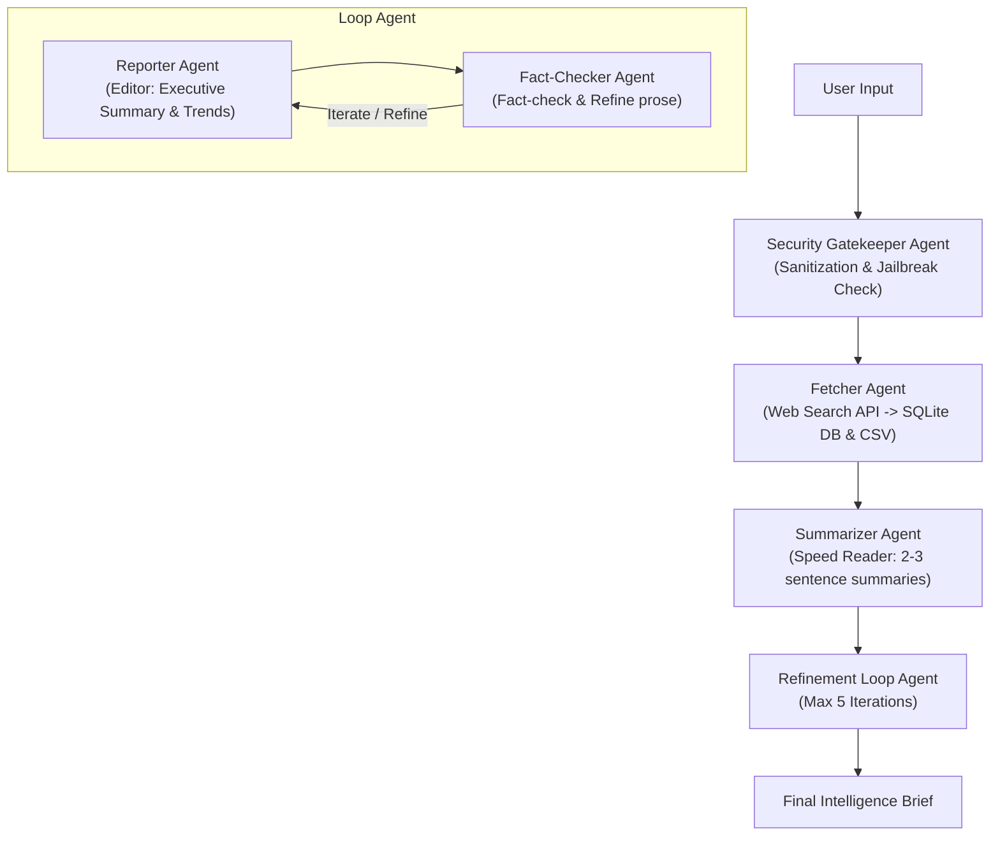

# Agentic-News-Summarizer

A production-grade, multi-agent summarizer assistant built with the Google Agent Development Kit (ADK) for summarizing and briefing of the news data. It orchestrates a multi-agent pipeline to ingest, sanitize, search, summarize, edit, and iteratively verify daily AI/ML news briefs.

---

## Agents Overview

The system delegates responsibilities across specialized, segregated agents:

1. **Security Gatekeeper Agent** (`app/agents/gatekeeper.py`):
   - Acts as the first line of defense.
   - Inspects user input for prompt injection, system overrides, and jailbreak attempts before allowing processing.
2. **Fetcher Agent** (`app/agents/fetcher.py`):
   - Makes web search API calls to retrieve fresh news and research articles.
   - Automatically enriches and organizes articles with metadata (word count, UTC timestamps, and unique IDs).
   - Persists all retrieved data into both **SQLite DB** (`articles.db`) and **CSV format** (`articles.csv`) for future reference.
3. **Summarizer Agent** (`app/agents/summarizer.py`):
   - Acting as the "speed reader", it analyzes articles with Gemini API context understanding.
   - Generates concise summaries restricted strictly to **2-3 sentences** per article.
4. **Reporter Agent** (`app/agents/reporter.py`):
   - Acting as the editor, it synthesizes all article summaries into one cohesive report.
   - Produces an Executive Summary, detailed analysis, and trend insights.
5. **Fact-Checker & Refiner Agent** (`app/agents/fact_checker.py`):
   - Works collaboratively with the Reporter Agent inside a `LoopAgent` to fact-check claims, correct inaccuracies, and refine prose.

---

## System Architecture



---

## Key Features

- **Security Gatekeeper**: Pre-screens all user inputs for prompt injections and jailbreaks.
- **Multi-Agent Orchestration**: Powered by ADK `SequentialAgent` and `LoopAgent` (with a maximum of 5 refinement iterations).
- **Dual-Storage Persistence**: Automatically saves all fetched articles into both **SQLite (`articles.db`)** and **CSV (`articles.csv`)**.
- **Context Compaction**: Managed via `EventsCompactionConfig` and `LlmEventSummarizer` to handle long multi-turn sessions smoothly.
- **A2A Protocol Support**: Built-in A2A agent-to-agent communication and FastAPI endpoints.

---

## Project Structure

```
Agentic-News-Summarizer/
├── app/
│   ├── agent.py                 # Root agent & App definition (with context compaction)
│   ├── fast_api_app.py          # FastAPI backend server with A2A & feedback routes
│   ├── db.py                    # SQLite DB and CSV storage utilities
│   ├── agents/                  # Segregated agent modules
│   │   ├── gatekeeper.py        # Security & sanitization agent
│   │   ├── fetcher.py           # Fetcher agent & web search tool
│   │   ├── summarizer.py        # Summarizer agent
│   │   ├── reporter.py          # Reporter agent
│   │   ├── fact_checker.py      # Fact-checker agent
│   │   └── pipeline.py          # Sequential & Loop orchestration pipeline
│   └── app_utils/               # A2A, services, and typing helpers
├── tests/
│   ├── eval/                    # Evaluation datasets & configuration
│   ├── integration/             # Integration tests
│   └── unit/                    # Unit tests
├── articles.db                  # Local SQLite articles database (auto-created)
├── articles.csv                 # Local CSV articles storage (auto-created)
├── .agents-cli-spec.md          # Agent specification
└── pyproject.toml               # Project configuration & dependencies
```

---

## Usage & Development Commands

| Command | Purpose |
|---------|---------|
| `agents-cli install` | Install project dependencies via `uv` |
| `agents-cli run "prompt"` | Run a quick smoke test of the agent |
| `agents-cli playground` | Launch local interactive web playground |
| `agents-cli eval run` | Run evaluation suite against test datasets |
| `agents-cli lint` | Run code quality checks (Ruff, Codespell) |
| `uv run pytest tests/unit tests/integration` | Run unit and integration tests |

---

## Evaluation & Quality Metrics

The project uses `agents-cli eval` for rigorous, non-deterministic agent evaluation:
- **Custom Response Quality (`tests/eval/response_quality.py`)**: LLM-as-a-judge criteria scoring response accuracy, citation grounding, formatting, and tone.
- **Evaluation Config (`tests/eval/eval_config.yaml`)**: Defines metrics to run and test thresholds.
- **Eval Datasets (`tests/eval/datasets/basic-dataset.json`)**: Contains test scenarios for brief generation, agent queries, and jailbreak security filtering.
